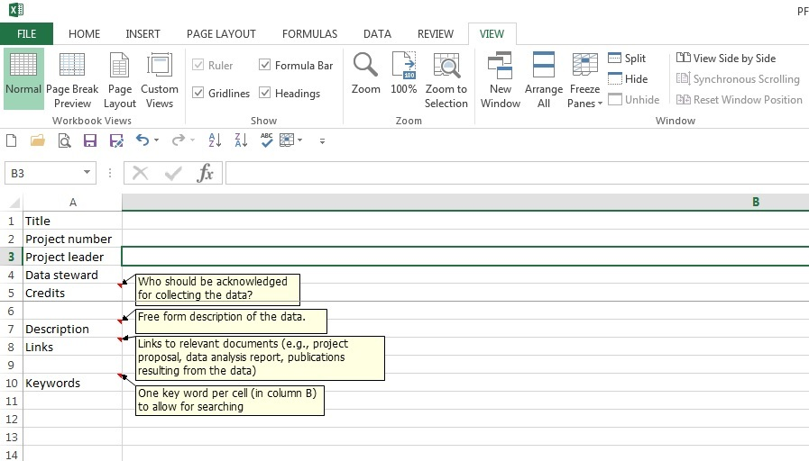
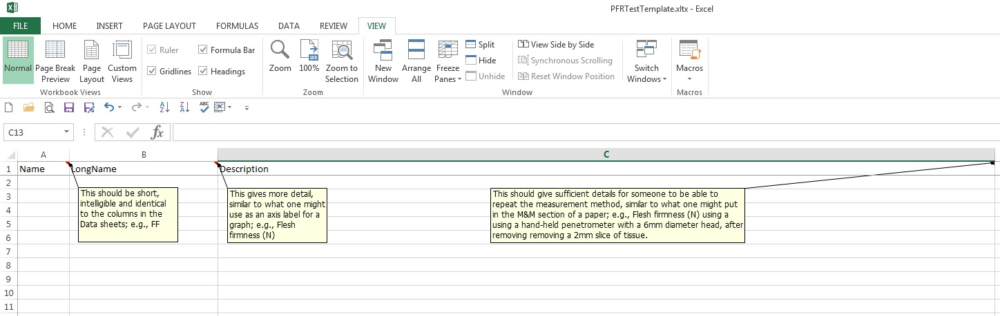
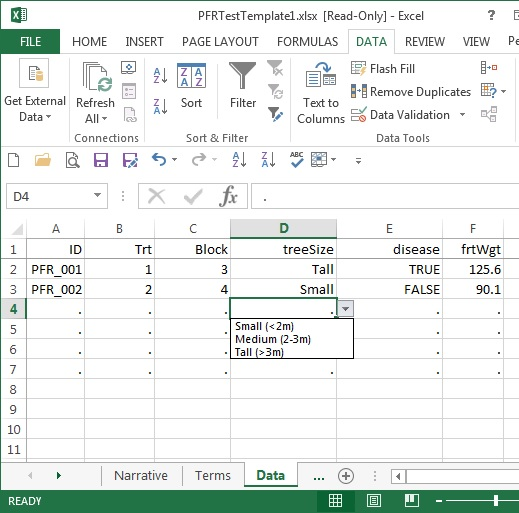

# Best practice use of spreadsheets for data storage

This is a best practice document for spreadsheet (e.g. Excel) files containing measured data. These practices are based on my experience, and that of my ex-colleagues at the [Plant and Food Research Institute of NZ](http://www.plantandfood.co.nz/) whose input I gratefully acknowledge. The aim is definitely not to make life difficult, but to reduce time spent on cleaning data by you as well as others.  Time is valuable and so are you. A lot of these suggestions also apply to files you use for analysing your data.

## Guiding principles

* Data should be easy to search for and find by anyone in INIAP at any time.
* It should be clear what the data are and who should be credited.

## Stewardship

Good data management doesn't just happen.  It is a good idea to nominated __data stewards__ who work within a science team or science project, ensuring that the team or project's data are appropriately managed.

## Storage

* Data should be in an accessible location for collaboration and should be backed up and version-tracked. The cloud provides various options for this if INIAP doesn't have the necessary infrastructure.
* Changes should be documented, preferably with an audit trail.

## File name conventions

* __Define (and adhere to) a naming convention for your project__.
* If possible, avoid spaces in filenames as these can cause difficulties when accessing files using some command-line tools.
* Use either [camel case](http://en.wikipedia.org/wiki/CamelCase) (i.e. upperAndLowerCase) or underlines to separate words (e.g. TrialXYZ2009LabDataxlsx or trialXYZ_2009_LabData.xlsx).
* Use dates in YMD order (e.g. YYYY_MM_DD, 2010_03_15) which will give you a better  [alphanumeric](https://en.wikipedia.org/wiki/Alphanumeric) sorting order when listing directories.
* It is safest to use just letters and numbers - in particular avoid [metacharacters](http://en.wikipedia.org/wiki/Metacharacter), i.e.  . (except to delimit the extension) [ ] { } ( ) \ ^ $ | ? * and  +.
* Use filenames that will be meaningful to colleagues.

## Content

* Develop and use a small collection of [data templates](https://support.office.com/en-us/article/Save-a-workbook-or-worksheet-as-a-template-58c6625a-2c0b-4446-9689-ad8baec39e1e).  In Excel, choose File/New/... to get the appropriate template when creating a new data file.  Company-wide templates can be the basis for creating project-specific templates; for example, if the Terms Sheet is the same or similar for many projects.
* Provide one sheet with a narrative (The Narrative Sheet), project code(s), name and contact of researcher (link to be provided), and list of key words for searching (one keyword per cell).
* Provide one sheet with a list of features measured and a description (The Terms Sheet).
* For most projects, it is appropriate to provide one sheet with the trial design.
* Provide one or more sheets with the measured data (see below) (The Data Sheet).
* **Never** password protect an Excel sheet or workbook.

## Sheets

### Narrative Sheet

&nbsp;
&nbsp;

* This is sometimes called the Cover Sheet.
* It should always contain some fields
    + Title
    + Project ID/number
    + Project leader
    + Data steward
    + Credits
    + Description
    + Keywords 
* It can have [hyperlinks](https://en.wikipedia.org/wiki/Hyperlink) to documentation (e.g. reports, milestone documents), but don't rely exclusively on links as they can break.
* To facilitate search-ability, there should only be one keyword per cell.

### Terms Sheet

&nbsp;
&nbsp;

* This sheet describes the columns in the Data Sheet(s) in more detail.
* It should contain three columns: the first column exactly matches the column headers in the Data Sheet(s), the second column describes it in more detail as one might in a figure caption, and the third gives the detail that might be in the Methods and Materials section of a manuscript (i.e. sufficient to allow another researcher to replicate the method exactly).  For example, frtWgt : Fruit weight (g) : Average weight (g) of a single fruit at harvest based on a sample size as given in nFrtSamp.
* Every column in the Data Sheet(s) should have an entry in the Terms Sheet, but it may not be necessary to complete the third (or even second) column if the term is fully self-explanatory.
* Even 'obvious' terms are not always so for researchers from a different discipline (e.g. 'block' to some is obviously the orchard block, but to others would obviously be a feature of the statistical design of the experiment).

### Data Sheet

&nbsp;
&nbsp;

* Raw data should occur as __a single contiguous block with a single header row followed by the rows of data, with one record per row__.  If using a paper-based data collection method, it is best if its format matches that of the Data Sheet (i.e. a single contiguous block with one record per row).
* Ideally, a Data Sheet will contain __only__ the single contiguous block (the Terms Sheet provides the extra detail). This can make life easier when accessing the data by third-party software (e.g. statistical packages).  However, some people like to have an explanation of the column names above the single header row (e.g. as recommended [the Reading University guidelines](http://www.reading.ac.uk/ssc/n/resources/Docs/Spreadsheets_for_Data_Entry%20%28Excel%202007%29.pdf)).  Similarly, one might might wish to have a couple of rows above the header row giving the minima and maxima for data checking (see below).
* The column names in the header row should:
    + contain only alpha-numeric characters (i.e. no [metacharacters](http://en.wikipedia.org/wiki/Metacharacter) or other punctuation)
    + begin with a letter (not a digit)
    + exactly match the names in the Terms Sheet
    + be unique
    + be short but decipherable
    + be consistent, including [case sensitivity](http://en.wikipedia.org/wiki/Case_sensitivity), across years and similar trials
    + follow a system which is preferably documented (e.g. 'Harvest date' and 'Harvest maturity' should be abbreviated consistently - perhaps harvDate and harvMat, not harvDate and HrvMat).
* Freeze the panes so that the header row is always visible.
* There should only be one type (i.e. numbers, dates, text) of data in a column.  For example, don't put "Dead" in a column for flowering date, but use additional columns for such comments.
* By all means use colour and other formatting to high-light aspects of the sheet, but do not use these features to code for data (they are not easily readable by other software).  Similarly, be sparing with the use of in-cell comments and do not merge cells in the data area.
* Be __very careful__ when sorting data in Excel to include all of the relevant data columns - otherwise data rows can become irretrievably misaligned.
* Avoid use of hidden columns and rows within the data area - these can be easily overlooked by viewers of the spreadsheet, and software that imports Excel data will probably include the "hidden" cells to the surprise of those doing the analysis.
* Figures should not be on the Data Sheet.
* Do not embed calculated rows (e.g. means), but use pivot tables instead.  Calculated columns are acceptable.
* Once data collection and checking is complete, freeze the Data Sheet so that all data are **read only** within it.

## Data checking

* Use Excel's [data validation](https://www.google.co.nz/url?sa=t&rct=j&q=&esrc=s&source=web&cd=1&cad=rja&uact=8&ved=0CBsQFjAAahUKEwib4OiOts3IAhWlrKYKHQj5CRk&url=https%3A%2F%2Fsupport.office.com%2Fen-us%2Farticle%2FApply-data-validation-to-cells-c743a24a-bc48-41f1-bd92-95b6aeeb73c9&usg=AFQjCNG5Ms2uOq7IVPuVgBtaDsv17tysLA&sig2=n9fdPizIEyRS7sSxuUahCg), as in the Data Sheet screen-shot with the drop-down menu for treeSize.  Note, this can be configured to issue a warning rather than trigger an error if numbers are outside the expected range.
* Use simple checks of minima and maxima, either as a couple of rows along the top (which can be removed once all data collection is complete) or as a pivot table.
* Be aware that Excel may automatically apply irreversible formatting to your data. According to Microsoft support:
    + If a number contains a slash mark (/) or hyphen (-), it may be converted to a date format
    + If a number contains a colon (:), or is followed by a space and the letter A or P, it may be converted to a time format
    + If a number contains the letter E (in upper- or lower-case; for example, 10e5), or the number contains more characters than can be displayed based on the column width and font, the number may be converted to scientific notation, or exponential, format
    + If a number contains leading zeros, the leading zeros are dropped.
   
Certain types of data (e.g. clone identifiers, gene names, plate coordinates) are particularly susceptible to these issues. To avoid the problem, make sure to first select the whole spreadsheet and Format -> Cells -> Number -> Text when pasting data into Excel (the default is "General").  If using this approach, even genuine dates will be regarded as text, and very long data strings (e.g. sequence data) may be converted to hash (#) characters. If this occurs, it is necessary to switch these cells back to "General" format.

See also
--------

* [Twenty principles for good spreadsheet practice](http://www.icaew.com/~/media/corporate/files/technical/information%20technology/excel%20community/166%20twenty%20principles%20for%20good%20spreadsheet%20practice.ashx)
* [Spreadsheet design](http://www.ozgrid.com/Excel/ExcelSpreadsheetDesign.htm)
